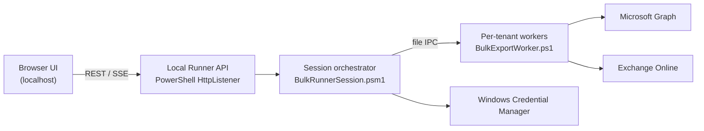

# Bulk Analyzer Web UI + Local Windows Runner (Option B)

This document describes the target architecture for a **browser-based bulk analyzer** that keeps **interactive Graph/Exchange login** and **app registration (WCM) credentials** working the same way as today's `BulkTenantExporter.ps1`, by requiring a **local Windows runner** on the analyst's PC.

## Why Option B

The standalone bulk exporter is not "just Graph API calls." It depends on:

| Capability | Today | Cloud-only web problem |
|---|---|---|
| Graph app-only auth | WCM (`EOA-GraphApp-{tenantId}`) via `GraphAppCredential.psm1` | No WCM in browser |
| Graph interactive auth | `Connect-MgGraph` / MSAL in worker process | Needs token broker on runner host |
| Exchange interactive auth | `Connect-ExchangeOnlineWithDefaults` in worker | EXO module + browser/WAM on Windows |
| Report collectors | `ExportUtils.psm1` (Graph + EXO PowerShell) | Many reports are EXO cmdlet-based |

Option B accepts a **local runner** so you reuse `Scripts/BulkExportWorker.ps1` and existing modules with minimal rewrite.

## High-level topology



**Phase A (now):** Browser + API + workers all on the same Windows machine (`localhost`).

**Phase B (later):** Same UI/API pattern; optional remote hosting of API if each analyst still runs a lightweight **runner agent** on their PC that owns auth popups and EXO modules.

## What stays unchanged

Reuse these assets as-is or with thin wrappers:

| Asset | Role |
|---|---|
| `Scripts/BulkExportWorker.ps1` | Per-tenant worker; handles `GRAPH_AUTH`, `EXCHANGE_AUTH`, `VALIDATE_USERS`, `GENERATE_REPORTS`, etc. |
| `Modules/ExportUtils.psm1` | Report generation |
| `Modules/GraphAppCredential.psm1` | WCM read/write, app create, export/import `.eoa-creds` |
| `Modules/ExchangeOnline.psm1` | `Connect-ExchangeOnlineWithDefaults` |
| `Start-NewGraphInboxRulesApp.ps1` | Interactive Create / Update Graph App scopes admin flow |

## Worker command protocol (existing)

The WinForms GUI already talks to workers via temp-dir file IPC. The web runner uses the **same protocol**:

| File | Purpose |
|---|---|
| `{commandDir}/Client{N}_Command.txt` | GUI/API writes command |
| `{commandDir}/Client{N}_Response.txt` | Worker writes result |
| `{tempDir}/Client{N}_Status.txt` | Worker append-only log |
| `{tempDir}/Client{N}_Result.txt` | Worker lifecycle / export result |

### Commands (from `BulkExportWorker.ps1`)

| Command | Purpose |
|---|---|
| `GRAPH_AUTH` | Start Graph authentication |
| `GRAPH_AUTH\|TENANT_ID:{guid}` | Graph auth using WCM app for tenant |
| `GRAPH_AUTH\|...\|INTERACTIVE:1` | Force browser interactive (skip WCM) |
| `EXCHANGE_AUTH` | Interactive Exchange Online connect |
| `VALIDATE_USERS\|SEARCH_TERMS:...` | User filter validation |
| `REMEDIATE_REVOKE_SESSIONS\|USERS:[...]` | Graph REST revoke sign-in sessions |
| `REMEDIATE_BLOCK\|USERS:[...]` / `REMEDIATE_UNBLOCK\|USERS:[...]` | Graph REST `accountEnabled` |
| `REMEDIATE_SIGNIN_STATUS\|USERS:[...]` | Graph REST read `accountEnabled` + token write scopes |
| `REMEDIATE_RESET_PASSWORD\|USERS:[...]\|OPTIONS:{...}` | Graph `passwordProfile` reset (random or assigned). Response includes SSPR URL; password is not returned. |
| `REMEDIATE_LIST_AUTH_METHODS\|USERS:[...]` / `REMEDIATE_DELETE_AUTH_METHODS\|ITEMS:[...]` | Graph MFA / auth methods |
| `REMEDIATE_LIST_DEVICES\|USERS:[...]` / `REMEDIATE_DELETE_DEVICES\|DEVICES:[...]` | Entra registered/owned devices |
| `REMEDIATE_LIST_APPS` / `REMEDIATE_DELETE_APPS\|APPS:[...]` | App registrations + other-tenant enterprise apps |
| `REMEDIATE_LIST_OAUTH_GRANTS\|USERS:[...]` / `REMEDIATE_DELETE_OAUTH_GRANTS\|ITEMS:[...]` | User OAuth / delegated consents |
| `REMEDIATE_REREGISTER_MFA\|USERS:[...]` | Delete removable MFA methods + revoke sessions |
| `REMEDIATE_LIST_INTUNE\|USERS:[...]` / `REMEDIATE_WIPE_INTUNE\|DEVICES:[...]` / `REMEDIATE_RETIRE_INTUNE\|DEVICES:[...]` | Intune managed devices |
| `REMEDIATE_LIST_ROLES\|USERS:[...]` / `REMEDIATE_DELETE_ROLES\|ITEMS:[...]` | Directory roles, groups, Exchange RBAC |
| `REMEDIATE_LIST_APP_CREDS` / `REMEDIATE_DELETE_APP_CREDS\|ITEMS:[...]` | App secrets and owners (certs listed only) |
| `REMEDIATE_LIST_MOBILE_DEVICES\|USERS:[...]` / `REMEDIATE_DELETE_MOBILE_DEVICES\|ITEMS:[...]` | Exchange ActiveSync partnerships |
| `REMEDIATE_LIST_FOLDER_PERMS\|USERS:[...]` / `REMEDIATE_DELETE_FOLDER_PERMS\|ITEMS:[...]` | Mailbox folder ACL |
| `REMEDIATE_GET_AUTOREPLY\|USERS:[...]` / `REMEDIATE_DISABLE_AUTOREPLY\|USERS:[...]` | Automatic replies |
| `REMEDIATE_LIST_ORG_FORWARD` / `REMEDIATE_SET_ORG_FORWARD\|ITEMS:[...]` | RemoteDomain + outbound spam auto-forward |
| `REMEDIATE_LIST_JUNK\|USERS:[...]` / `REMEDIATE_DELETE_JUNK\|ITEMS:[...]` | Junk trusted senders/recipients |
| `REMEDIATE_LIST_JOURNAL` / `REMEDIATE_DELETE_JOURNAL\|ITEMS:[...]` | Journal rules |
| `REMEDIATE_GET_MAILBOX_HOLD\|USERS:[...]` / `REMEDIATE_SET_MAILBOX_HOLD\|USERS:[...]` | Litigation hold / retain / audit |
| `REMEDIATE_LIST_ELSEWHERE\|USERS:[...]` / `REMEDIATE_DELETE_ELSEWHERE\|ITEMS:[...]` | This user's rights on other mailboxes |
| `REMEDIATE_LIST_FLOWS` / `REMEDIATE_DELETE_FLOWS\|ITEMS:[...]` | Power Automate via Get-AdminFlow if loaded |
| `REMEDIATE_RESTRICTED_EMAIL_STATUS\|USERS:[...]` | EXO `Get-BlockedSenderAddress` |
| `REMEDIATE_UNRESTRICT_EMAIL\|USERS:[...]` | EXO `Remove-BlockedSenderAddress` |
| `REMEDIATE_LIST_INBOX_RULES\|USER:upn` | EXO `Get-InboxRule -IncludeHidden` |
| `REMEDIATE_DELETE_INBOX_RULES\|USER:upn\|RULES:[...]` | EXO `Remove-InboxRule` |
| `REMEDIATE_MAILBOX_STATUS\|USERS:[...]` | Mailbox forwarding + FullAccess / SendAs / SendOnBehalf |
| `REMEDIATE_SET_FORWARDING\|USER:upn\|SMTP:addr\|DELIVER:0\|1` | `Set-Mailbox` forwarding |
| `REMEDIATE_CLEAR_FORWARDING\|USERS:[...]` | Clear all mailbox forwarding |
| `REMEDIATE_REMOVE_FORWARDING\|ITEMS:[...]` | Clear selected SMTP and/or recipient forwarding |
| `REMEDIATE_ADD_DELEGATION\|USER:upn\|DELEGATE:upn\|RIGHT:...` | Add FullAccess / SendAs / SendOnBehalf |
| `REMEDIATE_REMOVE_DELEGATION\|USER:upn\|DELEGATE:upn\|RIGHT:...` | Remove those grants |
| `REMEDIATE_LIST_TRANSPORT_RULES` / `REMEDIATE_DELETE_TRANSPORT_RULES\|RULES:[...]` | Tenant transport rules |
| `REMEDIATE_LIST_CONNECTORS` / `REMEDIATE_DELETE_CONNECTORS\|CONNECTORS:[...]` | Inbound/outbound connectors |
| `GENERATE_REPORTS\|...` | Run export |
| `GRAPH_DISCONNECT` | Clear Graph session |
| `CANCEL_AUTH` | Reset auth state |
| `EXIT` | Stop worker |

### Response tokens

| Response | Meaning |
|---|---|
| `GRAPH_AUTH_STARTED` | Auth in progress (poll for final) |
| `GRAPH_AUTH_SUCCESS:...` | Graph ready |
| `GRAPH_AUTH_FAILED:...` | Graph failed |
| `EXCHANGE_AUTH_STARTED` | EXO auth in progress |
| `EXCHANGE_AUTH_SUCCESS` | EXO ready |
| `EXCHANGE_AUTH_FAILED:...` | EXO failed |
| `REMEDIATE_STARTED` | Containment command accepted |
| `REMEDIATE_SUCCESS:...` | Containment write/status JSON |
| `REMEDIATE_RESTRICTED:...` | Restricted Users status JSON |
| `REMEDIATE_RULES:...` | Inbox rules JSON |
| `REMEDIATE_MAILBOX:...` | Forwarding / delegation JSON |
| `REMEDIATE_TRANSPORT:...` | Transport rules JSON |
| `REMEDIATE_CONNECTORS:...` | Connector JSON |
| `REMEDIATE_AUTHMETHODS:...` | MFA / authentication methods JSON |
| `REMEDIATE_DEVICES:...` | Entra device JSON |
| `REMEDIATE_APPS:...` | App registration / enterprise app JSON |
| `REMEDIATE_OAUTH:` / `REMEDIATE_MOBILE:` / `REMEDIATE_FOLDERS:` / `REMEDIATE_AUTOREPLY:` / `REMEDIATE_ORGFWD:` / `REMEDIATE_JUNK:` / `REMEDIATE_JOURNAL:` / `REMEDIATE_HOLD:` / `REMEDIATE_ELSEWHERE:` / `REMEDIATE_ROLES:` / `REMEDIATE_INTUNE:` / `REMEDIATE_APPCREDS:` / `REMEDIATE_FLOWS:` | Extra containment list/delete JSON |
| `REMEDIATE_FAILED:...` | Containment failed |

## Auth parity mapping

### Graph — app registration (same as today)

1. Analyst uses **Create Graph App** (`Start-NewGraphInboxRulesApp.ps1 -SaveToWCM`) or **Update Graph App scopes** (`-UpdateExisting`) locally.
2. Credentials land in WCM as `EOA-GraphApp-{tenantId}`.
3. Web UI loads tenant list from `Get-WCMTenantListWithNamesForAppRegCombo`.
4. Per-tenant **Graph Auth** sends `GRAPH_AUTH|TENANT_ID:{guid}` to worker.
5. Worker calls `Get-GraphAppTokenFromWCM` then validates via Graph.

**Later (hosted):** replace WCM with encrypted credential store + keep export/import `.eoa-creds` for migration.

### Graph — interactive (same as today)

1. User checks "Use interactive Graph" or no WCM creds match.
2. API sends `GRAPH_AUTH|INTERACTIVE:1` (optional `TENANT_ID`).
3. Worker sets MSAL/WAM bypass env vars and runs `Connect-MgGraph`.
4. Browser/WAM popup opens **on the runner machine** (same as today).

### Exchange — interactive (same as today)

1. After Graph succeeds (when both required), API sends `EXCHANGE_AUTH`.
2. Worker calls `Connect-ExchangeOnlineWithDefaults`.
3. Browser auth popup on runner machine.

**Headless fallback:** `Connect-ExchangeOnline -Device` for rare unattended scenarios (not default).

## Local runner API (Phase A)

Implemented in `web-runner/Start-BulkWebRunner.ps1` + `web-runner/Modules/BulkRunnerSession.psm1`.

| Method | Path | Description |
|---|---|---|
| `GET` | `/api/health` | Runner version, pid, session id |
| `POST` | `/api/shutdown` | Localhost only — stop tenant workers and exit so a new start can take the port |
| `POST` | `/api/session` | Create session (report selections JSON body) |
| `GET` | `/api/session` | Current session metadata |
| `POST` | `/api/tenants` | Add tenant worker (`Add-Tenant`) |
| `GET` | `/api/tenants` | List tenants + auth flags |
| `POST` | `/api/tenants/{n}/command` | Send worker command; returns response or `{ started: true }` |
| `GET` | `/api/tenants/{n}/worker` | Worker process alive check (`workerAlive`, `processId`) |
| `POST` | `/api/tenants/{n}/ensure-worker` | Restart worker if dead; used before Generate/auth commands |
| `GET` | `/api/tenants/{n}/status` | Tail of status file |
| `POST` | `/api/tenants/{n}/containment-pack` | Write per-user containment zips + `Remediation.csv` (account-change log) |
| `POST` | `/api/tenants/{n}/copy-containment-zips` | Copy `Containment_*.zip` and merge `Remediation.csv` into a new report folder |
| `GET` | `/api/app-registrations` | WCM tenant list for dropdown |
| `POST` | `/api/manage/ticket` | Fetch ConnectWise Manage service ticket text (`{ "ticketId": "1873776" }`) |
| `GET` | `/` | Static web UI |

Poll `/api/tenants/{n}/command` with `{ "command": "GRAPH_AUTH", "waitSeconds": 120 }` for long auth flows — same pattern as WinForms polling after `*_STARTED`.

## Phased delivery

### Phase A — Localhost web shell (current)

- [x] Architecture doc
- [x] `BulkRunnerSession.psm1` — session + IPC without WinForms
- [x] `Start-BulkWebRunner.ps1` — localhost API + static UI
- [x] Wire Generate Reports + ticket # / Manage fetch (`POST /api/manage/ticket`)
- [x] Full report-selection UI (session + per-tenant overrides, presets via `GET /api/export-presets`)
- [x] Create Graph App / Update Graph App scopes / export-import creds / clear WCM (`/api/wcm/*`)
- [x] Hidden workers + tabbed log UI with status polling (Activity + Client N)
- [x] Session history save/restore/archive
- [x] Post-export analysis (`POST /api/analyze-reports`), Graph logout/reset, ticket email extraction
- [x] Worker alive check + auto-restart before Generate/auth (safe re-runs with new dates or report selections)
- [ ] SSE or WebSocket for live status tail (polling is sufficient for now)

### Phase B — Credential abstraction

- Extract WCM behind `Get-TenantGraphCredentials` / `Save-TenantGraphCredentials`
- Add optional Azure Key Vault provider (same shape as WCM entries)
- Keep `.eoa-creds` export/import format

### Phase C — Optional remote API

- Runner agent registers with central API; auth still executes on analyst Windows box
- Central store for job metadata + downloaded XLSX artifacts
- Workers remain on Windows with EXO module

## Security notes

- Bind API to `127.0.0.1` only in Phase A (no LAN exposure).
- Command files already validated via `Read-CommandFile` when SecurityHelpers present.
- Never expose WCM secrets to the browser — API returns tenant **display names + tenant IDs** only.
- Each tenant worker keeps isolated `MSAL_CACHE_DIR` (same as today).

## Quick start (Phase A scaffold)

```powershell
cd C:\Git\exchangeonlineanalyzer\exchangeonlineanalyzer
.\web-runner\Start-BulkWebRunner.ps1
# Opens http://127.0.0.1:8765/
```

Requires: PowerShell 5.1+, modules already used by `BulkTenantExporter.ps1`.

## Relation to archived `web/` tree

The repo previously included a FastAPI bulk console (see `AGENTS.md` archive at `C:\git\archives\exchangeonlineanalyzer-web-archive.tgz`). Option B intentionally **does not** require restoring that stack for Phase A. You can borrow UI ideas from the archive later; the worker IPC protocol above is the stable integration surface.
